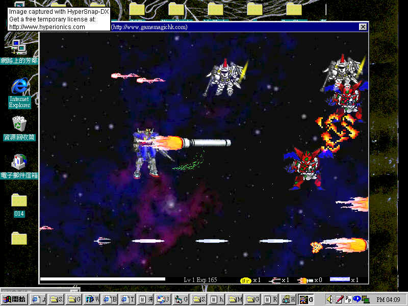



## GOD of Battle Shooting Game

### Description

A Cool VB STG with easy learn source code provided ,

you can see how to use transparent/semi-transparent effect , anime effect , sound/music effect , moving background , keyboard controlling , collision detecting , picture resize , delay time setting and so on.

Enjoy it , Thanks ^^

GOD of Battle homepage :

http://hkgod.org/Orphen/GOBweb/
 
### More Info
 
Need VB to run

             |
---                |---
**Submitted On**   |2001-03-01 18:57:10
**By**             |[Basara \(Leung Po Hei\)](https://github.com/Planet-Source-Code/PSCIndex/blob/master/ByAuthor/basara-leung-po-hei.md)
**Level**          |Intermediate
**User Rating**    |5.0 (15 globes from 3 users)
**Compatibility**  |VB 6\.0
**Category**       |[Games](https://github.com/Planet-Source-Code/PSCIndex/blob/master/ByCategory/games__1-38.md)
**World**          |[Visual Basic](https://github.com/Planet-Source-Code/PSCIndex/blob/master/ByWorld/visual-basic.md)
**Archive File**   |[CODE\_UPLOAD15630312001\.zip](https://github.com/Planet-Source-Code/basara-leung-po-hei-god-of-battle-shooting-game__1-21363/archive/master.zip)

